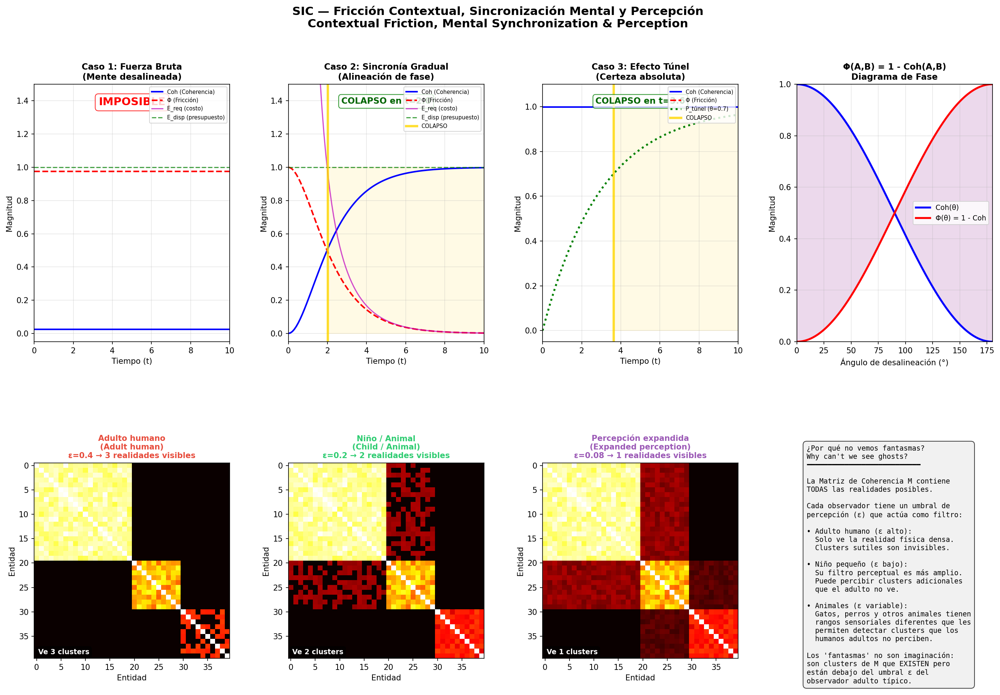
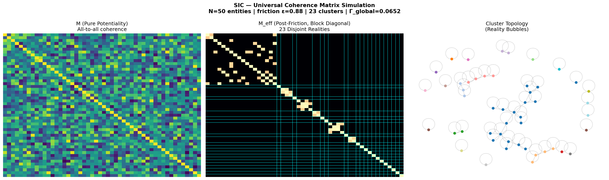
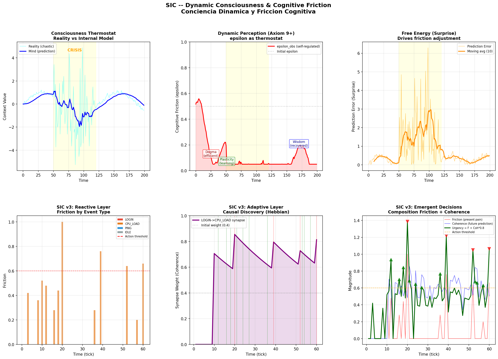

# SIC — Integrative Contextual Synthesis Metalanguage

> *Metalenguaje de Sintesis Integrativa Contextual*

A formal mathematical metalanguage for unifying phenomena across **contexts**, **scales**, and **perspectives**.

```
E{C, S, P}    where C = Context, S = Scale, P = Perspective
```

Things mean something different depending on the context, scale, and perspective from which they are observed. SIC formalizes this intuition into an operative mathematical system.

---

### Figure 1: SIC Dynamics & Topology



> **(Top)** Simulation of the energy cost to transit between realities. Internal synchronization (phase tuning) enables the "tunnel effect", reducing contextual friction to near zero. **(Bottom)** The Observer Effect modeled as a dispersion filter (`ε`). The reality we perceive depends on our coherence acceptance threshold. What for a skeptical adult (`ε=0.4`) is invisible noise, for an expanded perception (`ε=0.08`) is a tangible causal connection.

---

## Core Idea

Every phenomenon exists relative to a contextual frame. SIC provides:

- **Contextual Entities** `E{C, S, P}` — the fundamental objects
- **Operators** `⊕` (composition), `×` (modulation), `∘` (transformation) — to combine and transform them
- **Contextual Calculus** — derivatives and integrals over context space, now computable via continuous parametrization
- **Coherence Metrics** `Coh(C₁, C₂) ∈ [0, 1]` — measuring compatibility between contexts
- **Inference Rules** — for reasoning within and across contexts

## Nine Axioms

| # | Name | Statement |
|---|------|-----------|
| 1 | Contextual Coherence | Every proposition has at least one context where it is coherent |
| 2 | Transformability | A transformation always exists between any two contexts |
| 3 | Constitutive Perspective | Perspective is constitutive of manifested reality |
| 4 | Coherence Reflexivity | `Coh(C, C) = 1` |
| 5 | Coherence Symmetry | `Coh(C₁, C₂) = Coh(C₂, C₁)` |
| 6 | Bounded Transitivity | `Coh(C₁, C₃) ≥ Coh(C₁, C₂) · Coh(C₂, C₃)` |
| 7 | Preservation under Transformation | Structure-preserving transforms cannot reduce coherence |
| 8 | Friction | Every context change `∂C ≠ 0` generates friction `Φ > 0` subtracted from internal update capacity |
| 9 | Relative Perception | The apparent topology of reality `𝕄_visible` depends on the observer's cognitive friction threshold `ε_obs` |

## Key Formalizations

- **`⊕_P` — Perspective Composition**: Independent primitive operation that resolves circularity in `⊕`
- **Continuous Parametrization**: `C = (type, θ₁, ..., θₙ)` — contexts as points in a continuous parameter space, enabling computable derivatives and integrals
- **Contextual Curvature Tensor `𝒦`**: The geometry of context space depends on the observer's perspective (§7.2)
- **Phase Transitions**: Jump operator `Δ` and distributional derivative for discontinuous context changes (§7.5)
- **Contextual Friction `Φ`**: `Φ(A,B) = 1 - Coh(A,B)` — the ontological incompatibility between states. Dynamic form uses metric tensor. Includes Processing Budget, Resonant Efficiency Corollary, and Contextual Tunnel Effect (§7.6)
- **Perception Dynamics**: `dε_obs/dt = κ·(σ_target - σ_current)` — consciousness as a self-regulating thermostat with homeostatic feedback, sanity limits, and three emergent phases: Dogma, Plasticity, Wisdom (§7.7)
- **Contextual Entanglement**: Universal Coherence Matrix `𝕄` where `𝕄ᵢⱼ = Coh(Cᵢ, Cⱼ)` — analogous to the quantum density matrix
- **Local Collapse**: Entanglement friction `ε` decomposes `𝕄` into sparse clusters; collapse is local and percolative, not global O(N³) (§11.4-11.5)
- **Algebraic Structure**: `(𝔈, ⊕)` is a commutative monoid (§13)
- **Twin Paradox**: Time dilation derived as contextual friction `Δ_age ∝ ∫|∂C/∂t| dt` without explicit relativity (§14.5)

## Contextual Entanglement & Reality Collapse

The contexts of all entities intertwine. When they cross, they generate a **probability matrix** whose collapse produces manifested reality:

```
𝕄 ∈ ℝᴺˣᴺ   where  𝕄ᵢⱼ = Coh(Cᵢ, Cⱼ)

Collapse condition:  R_manifest = v₁  when  λ₁/Tr(𝕄) > θ_collapse

Reality = mosaic of local collapses across clusters of 𝕄
```

| SIC | Quantum Mechanics |
|-----|-------------------|
| `𝕄` (Coherence Matrix) | `ρ` (Density matrix) |
| `Coh(Cᵢ, Cⱼ)` | `⟨ψᵢ\|ψⱼ⟩` (inner product) |
| Contextual entanglement | Quantum entanglement |
| Local collapse by resonance | Decoherence / measurement |
| Friction `ε` (truncation) | Environmental decoherence |
| Collapse percolation | Quantum phase transition |

### Figure 2: Coherence Matrix Simulation



*50 entities, friction `ε=0.88` -> 23 clusters. Small clusters collapse (high internal coherence), while the large cluster remains in superposition. Reality emerges as a mosaic of local collapses.*

## Contextual Friction & Perception

**Contextual Friction** `Φ(A,B) = 1 - Coh(A,B)` is the ontological incompatibility between two states (§7.6). It is the "tax" the universe charges for every context change.

### Why Can't We See Ghosts?

The simulation below explains this through the SIC framework. The Coherence Matrix `𝕄` contains **ALL possible realities** — physical, subtle, and ultra-subtle. What determines which realities an observer can perceive is their **perception threshold `ε`** (contextual friction filter):

| Observer | Threshold `ε` | What they see |
|----------|---------------|---------------|
| **Adult human** | High (0.4) | Only dense physical reality. Subtle clusters are invisible — filtered out by high friction. |
| **Young child** | Low (0.2) | Their perceptual filter is wider. They can perceive additional clusters that adults cannot — this is why children sometimes report seeing things adults dismiss. |
| **Animals** (cats, dogs, etc.) | Variable (0.08-0.3) | Different sensory ranges allow detection of clusters invisible to adult humans. This explains why animals sometimes react to "nothing." |

**"Ghosts" are not imagination** — they are clusters in `𝕄` that **exist** but fall below the typical adult human's perception threshold `ε`. The entities are real; it's our perceptual filter that excludes them.

### Mental Synchronization: Three Regimes

The mind does not change reality by force. It acts as a **phase tuner** — adjusting internal coherence to reduce friction:

| Regime | How it works | Result |
|--------|-------------|--------|
| **Brute Force** | Mind is misaligned with target (Coh ≈ 0, Φ ≈ 1) | Impossible — infinite energy required |
| **Gradual Synchrony** | Mind rotates its phase to align with target. As Coh grows, Φ drops until energy cost < budget | **Collapse occurs** — reality shifts with minimal energy |
| **Tunnel Effect** | Perfect alignment (Coh = 1) maintained over time. Probability accumulates in target sector of `𝕄` | **Spontaneous collapse** — barrier penetrated without "climbing" it |

> *"Infinite energy is only needed for those who try to change external context without changing their internal context first. For the synchronized mind, the universe is a superconductor."*


*Top row: Three synchronization regimes (brute force fails, gradual synchrony collapses at t=2.0, tunnel effect collapses at t=3.6). Bottom row: Same reality matrix seen through different perception thresholds — the adult sees 3 disconnected clusters, the child/animal sees 2, expanded perception sees everything as connected.*

### Dynamic Consciousness: The Thermostat (§7.7)

Axiom 9 defines `ε_obs` as a static filter. Section §7.7 extends it to a **dynamic variable** with homeostatic feedback:

```
dε_obs/dt = κ · (σ_target - σ_current)

High prediction error → ε drops (open to more information)
Low prediction error  → ε rises (filter noise)
```

Three emergent phases appear: **Dogma** (high ε, efficient but rigid), **Plasticity** (low ε, learning but vulnerable to noise), and **Wisdom** (self-regulated equilibrium). A system possesses *consciousness* (in the SIC sense) if its `ε_obs` is a function of internal state with homeostatic feedback and sanity limits (`ε_min` to avoid hallucination, `ε_max` to avoid catatonia).

## Nested Learning Architecture

The implementation architecture uses three nested contexts at different timescales:

```
Reactive    {C:immediate, S:ms, P:hardware}       — sensor → actuator
    ↕
Adaptive    {C:patterns, S:seconds, P:statistical} — adjusts reactive parameters
    ↕
Environmental {C:environment, S:minutes, P:strategic} — adjusts adaptive limits
```

**Event-driven**: no `delay()`, no fixed-frequency loops. Events propagate through contexts that "resonate" based on activation conditions. Memory decays exponentially with real time (`exp(-Δt/τ)` via `millis()`).

## Rust Formalization (`sic_core/`)

A type-safe formalization of SIC where Rust's ownership model maps directly to the metalanguage:

| Rust Feature | SIC Concept |
|-------------|-------------|
| `&'ctx Context` (lifetimes) | Temporal decay — entities can't outlive their context |
| Ownership (move semantics) | Contextual exclusivity — one owner per entity |
| Borrow checker | Safe event propagation — no aliased mutable contexts |
| `trait ContextProcessor` | Formalized interface between nested contexts |
| `Entity<'ctx>` (generics) | Compile-time context binding |

```
sic_core/
├── Cargo.toml
├── src/
│   ├── lib.rs              # Module declarations
│   ├── context.rs          # Context, Scale, Perspective types
│   ├── entity.rs           # Entity<'ctx> with lifetime-enforced context binding
│   ├── coherence.rs        # Coh(C₁,C₂), CoherenceMatrix 𝕄, friction, clustering
│   ├── operators.rs        # ⊕ compose, × modulate, T transform
│   ├── events.rs           # Event system, circular EventQueue
│   └── nested_learning.rs  # Three nested contexts with ContextProcessor trait
└── examples/
    └── demo.rs             # Full demonstration
```

Build and run (requires [Rust](https://rustup.rs)):
```bash
cd sic_core && cargo run --example demo
```

## Python Simulations (`simulacion_sic/`)

Three interactive simulations with visualization:

**1. Universal Coherence Matrix** (`simulacion_sic.py`):
- Generates N entities, builds `𝕄`, applies friction `ε`, finds clusters, computes collapse
- 3-panel visualization: raw matrix, block-diagonal ordering, cluster topology graph

```bash
cd simulacion_sic && pip install -r requirements.txt
python simulacion_sic.py --entities 50 --friction 0.88 --seed 42
```

**2. Mental Synchronization & Perception** (`sincronizacion_mental.py`):
- Three synchronization regimes (brute force, gradual, tunnel effect)
- Perception ranges: why adults, children, and animals see different realities
- Contextual friction `Φ = 1 - Coh` phase diagram

```bash
python sincronizacion_mental.py
python sincronizacion_mental.py --no-plot  # CLI-only report
```

**3. Dynamic Consciousness & SIC v3** (`conciencia_dinamica.py`):
- Consciousness thermostat: agent auto-regulates `ε_obs` based on prediction error, converging to the Wisdom phase
- SIC v3: three nested layers (Environmental/Reactive/Adaptive) with Hebbian learning and emergent synapses
- Prevention Paradox resolution: preventive actions reinforced at 0.5× (uncertain causality)
- 6-panel visualization: thermostat dynamics + SIC v3 emergent behavior

```bash
python conciencia_dinamica.py
python conciencia_dinamica.py --no-plot  # CLI-only report
```

### Figure 3: Dynamic Consciousness & SIC v3



*Top row: Consciousness thermostat — `ε_obs` self-regulates through three phases (Dogma → Plasticity → Wisdom) based on prediction error. Bottom row: SIC v3 three-layer system discovers hidden causal rule LOGIN→CPU_LOAD via Hebbian learning (synapse reaches 0.81), transitioning from reactive to preventive behavior.*

## Arduino Light Follower (`seguidor_luz_sic/`)

A working implementation validating the Nested Learning concept with real hardware.

**Hardware:** Arduino Uno/Nano/ESP32, 2x LDR (A0, A1 with 10kΩ pull-down), 1x SG90 Servo (Pin 9)

The sketch outputs CSV data via Serial (9600 baud) for real-time monitoring with Arduino Serial Plotter.

## Repository Structure

```
Meta_SIC/
├── README.md                              # This file
├── CLAUDE.md                              # Claude Code project guidance
├── Definiciones.md                        # Formal framework (Spanish) — §1-15
├── Definitions.md                         # Formal framework (English) — §1-15
├── Aplicaciones.md                        # Implementation (Spanish) — §16-17
├── Applications.md                        # Implementation (English) — §16-17
├── Proyectos.md                           # Projects & applications catalog (Spanish)
├── Projects.md                            # Projects & applications catalog (English)
├── sic_core/                              # Rust formalization
│   ├── Cargo.toml
│   ├── src/                               # Core library modules
│   └── examples/demo.rs                   # Full demonstration
├── simulacion_sic/                        # Python simulations
│   ├── simulacion_sic.py                  # Coherence matrix simulation
│   ├── sincronizacion_mental.py           # Friction, synchronization & perception
│   ├── conciencia_dinamica.py             # Dynamic consciousness & SIC v3
│   └── requirements.txt
└── seguidor_luz_sic/
    └── seguidor_luz_sic.ino               # Arduino sketch
```

Sections are numbered continuously: Definitions §1–15, Applications §16–17.

## Implementation Roadmap

| Phase | Language | Purpose | Status |
|-------|----------|---------|--------|
| 1: Tangible | C/C++ (Arduino) | Hardware validation — light follower | Working |
| 2: Formalization | Rust | Metalanguage interpreter, type-safe context system | **In Progress** |
| 2.5: Simulation | Python | Coherence matrix visualization & analysis | **Working** |
| 3: Applications | Rust/WASM | Production systems (monitoring, security, data pipelines) | Pending |

## License

See [LICENSE](LICENSE).

---

*Integrative Contextual Synthesis Metalanguage — Developed collaboratively by Miguel and Claude.*
